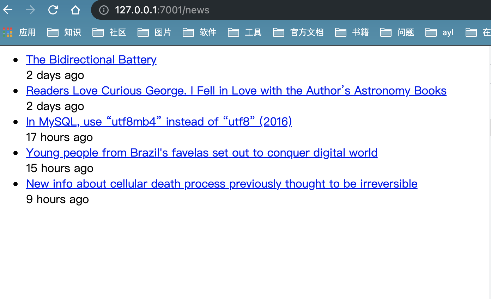
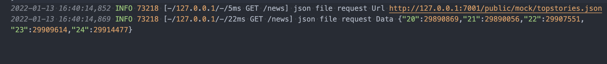

## egg

### 示例demo

[demo示例仓库地址](https://github.com/sneptune-love/egg-admin)

按照egg官方文档敲了一遍[示例demo](https://eggjs.org/zh-cn/intro/quickstart.html)，中间遇到一些问题，记录如下：

- 1、执行 `npm init egg` 异常

  node版本问题，最开始安装的时候使用`v13.1.0`版本，一直安装不上去，报出koa之类的问题，更换版本到`v14.9.0`就可以了

- 2、官方tpl模板文件中引入的css没有给具体内容，建议自行编写对应的css或者移除该引入

- 3、请求`topstories.json`文件的时候，一直提示超时

  配置文件中的 `serviceUrl: https://hacker-news.firebaseio.com/v0` 是被墙的。

  如果你开了代理，就会发现浏览器，postman都可以访问，但是示例代码里面cur无法正常访问。

  建议通过浏览器，或者postman将对应的json文件下载到自己部署的服务端口上，如果要放在本项目中，记得一定要放在public中。

---

在解决这几个问题后，示例demo正常运行起来，下来来让我们看看几张截图

> 渲染的列表页面，无css样式

> 接口数据打印

  

